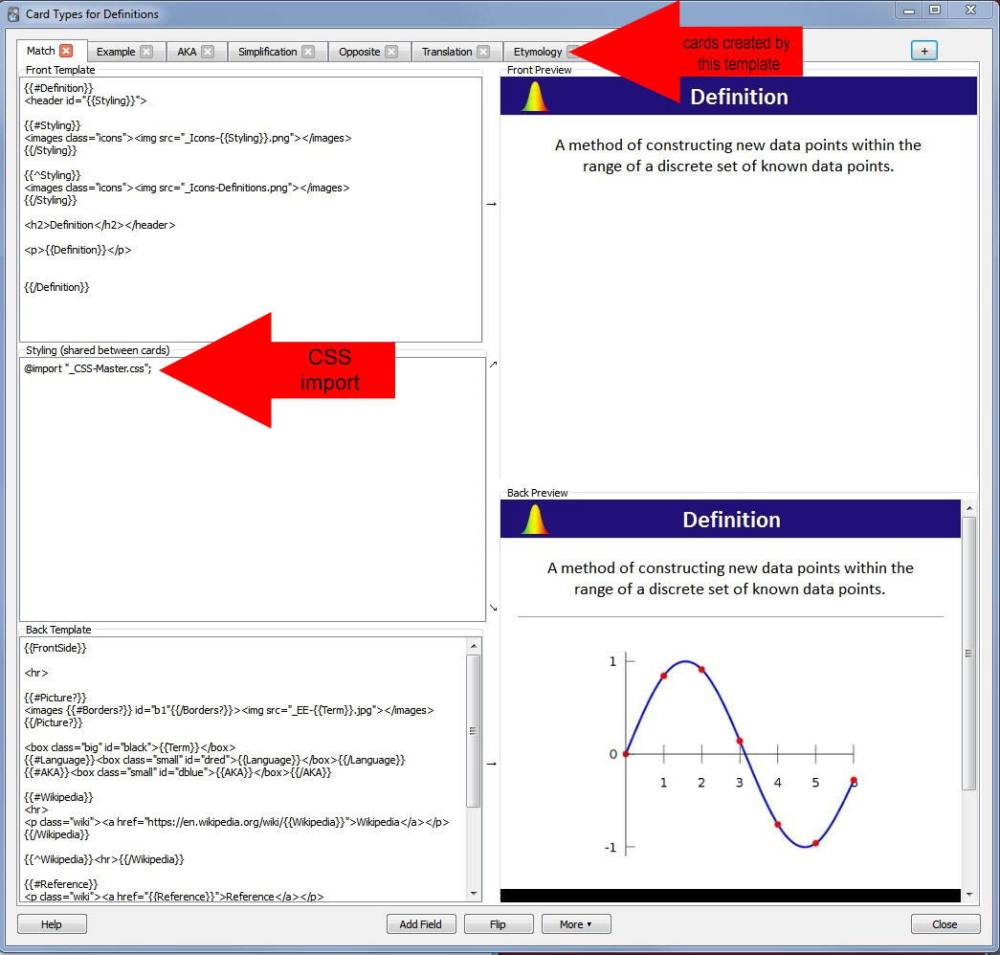
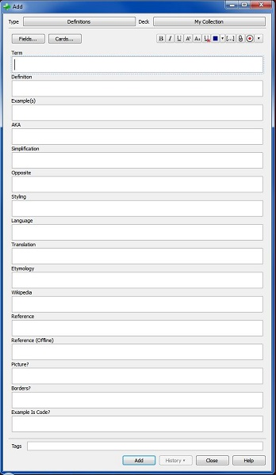
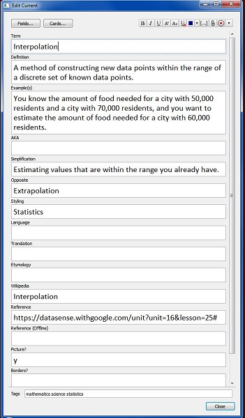
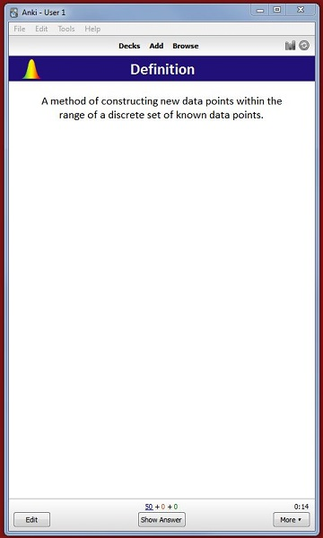
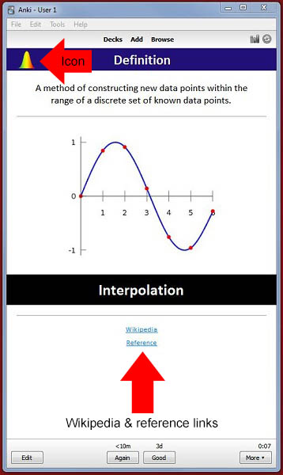

# Anki CSS File

## Description

This is the CSS file that runs my Anki deck. I've been working on for nearly two years now, and as you can probably see in the comments, it has undergone many changes. The deck itself has over 50 note types spread out over 11,500 (as of 3/21/2014) individual cards.

### *Note: If you'd like to get an in-depth look at how I use and structure Anki cards, please check out my book, [The Learning Factory](http://www.52aces.com/books).*

## How It Works

### Deck-Wide Changes via @import

If you don't know anything about Anki or SRS-style flash cards, I recommend you head over to <a href="http://www.ankisrs.net">Anki's official site</a> before going any further. There's a wealth of information there, and you can download the program itself for free.

From here, I'll assume that you are at least somewhat familiar with what Anki is and how it functions. Moving on.

Most Anki cards use styling in an internal, note-by-note fashion. That is, if you want to use a style, you just plunk it right there onto each note template. This works if you're only planning on having a very small number of note types. But for a deck like mine, that has around 50 different note templates, this simply is not feasible - particularly because there are classes and IDs that get used over and over again.

As a result of this, my notes all contain a simple <code><b>@import</b></code> call in their "Styling" box. This is illustrated below.

With this system, I can modify a class or ID across all note classes, rather than having to painstakingly modify each one's individual style. The only real downside is that Anki loads the CSS file only once (at startup), and any changes that are made don't appear until Anki is restarted. But even this can be negated, as any changes I'm contemplating can simply be added to the "Styling" box and tested. If it works out, then I can simply cut and paste the style code directly into my CSS file and restart.

### Adding Cards

The "Definitions" note type that is illustrated below is one of my most heavily used note types, so I will use it for demonstration purposes here. Simply put, this note type helps me remember various concepts by creating a variety of cards related to it.

In this case, I want to know the meaning and use of interpolation. So rather than just make a bland "Side A = term, Side B = meaning" type of card, I've refined it into something much more useful. For every term I enter, I can have cards created that include not only its definition, but examples of its use (the "Example(s)" field), nicknames (the "AKA" field), etymology, opposing concepts and more. Additionally, there are fields for Wikipedia entries and other references (both online and off) so that I can keep track of where my knowledge is coming from and refer there as needed. Each of these fields is a conditional, so a card will <b>not</b> be generated for the AKA field if it is blank.

There is a "Styling" field near the bottom that allows me to define the icons and color scheme for the cards generated as well. I have a collection of icons connected to each style (in this case, it is the icon connected to "Statistics"), and the CSS file contains color definitions for each one.

The way that these notes are set up, I don't have to drag and drop images and/or sounds (which I use heavily) into the fields themselves. I've found this to be a frustrating and disorganized way of doing things, particularly since Anki creates randomized file names for anything added in such a manner. Instead, I just add a file with the name of the term and a prefix of "_EE-" and the note will automatically incorporate it. For example, for interpolation's media files, I simply added "_EE-Interpolation.jpg" and "_EE-Interpolation.mp3".

The _ character is used so that Anki doesn't delete the media files in its unused media sweeps (which happens because the files are only being referenced, not being used directly in notes). The "EE" part simply means "Everything Else", and I did this only because I wanted to keep my language media files (for Spanish and French) separate from media files for cards in other subjects.

### The Finished Product

Below we can see the "Definition" card that is created from the note, which is, in this case, only one of several generated. A sound is played (if it is present in the media folder) when any of the answer buttons is pressed, and an image is displayed (if it is present, and the "Picture?" flag on the note template is activated). Answers are clearly displayed in the colored box below the image, and references are listed below that.

<h3 style="text-align:center"> Front & Back 

### Scratching the Surface

This is a very, very basic overview of how everything in my Anki deck works. If you'd like a more in-depth view of my system, check out my book, [The Learning Factory](http://www.52aces.com/books).
